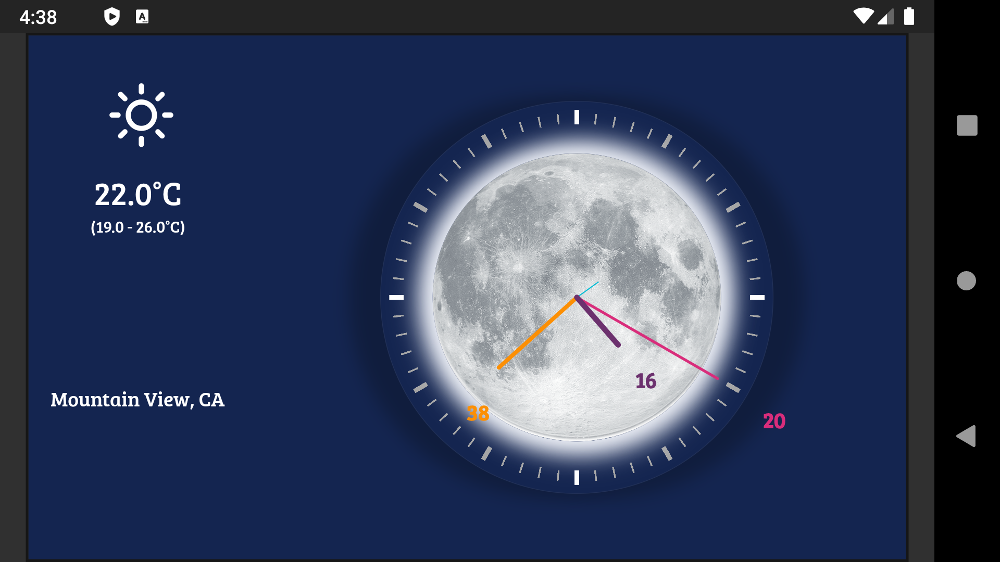

# Flutter Clock

You can see the best submitted clocks video on youtube channel and this clock is selected along with other 60 to show in the video among 850 clock submission in second 0:21.

here is the link for the flutter clock contest video : [click here][ytb]

## Analog Clock

This app is an analog clock for flutter clock contest.
It has a light theme and a dark theme, and displays sample weather and location data.

[ytb]: <https://www.youtube.com/watch?v=PaPUkxYHDUw>
